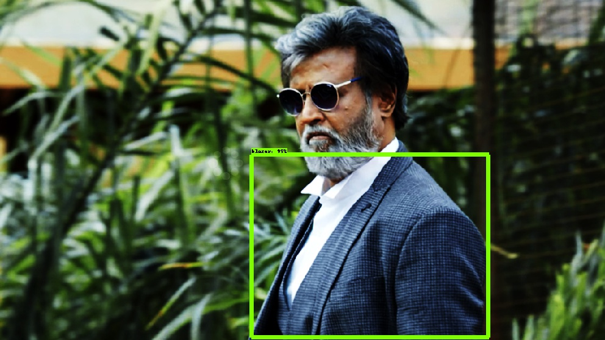

# Dress Detection from Image
A dress classifier trained on Bangladeshi dress types. Supported dress types:

 1. Panjabi
 2. Kamiz
 3. Lungi
 4. Shari
 5. Dhuti
 6. Borka
 7. Fotua
 8. Blazer
 9. Jacket
 10. Hijab
 11. Pant
 12. Shirt
 13. Sweater
 14. T-shirt

**Results**


## Installation

First, with python and pip installed, install the scripts requirements:

```bash
pip install -r requirements.txt
```
Then you must compile the Protobuf libraries:

```bash
protoc object_detection/protos/*.proto --python_out=.
```

Add `models` and `models/slim` to your `PYTHONPATH`:

```bash
export PYTHONPATH=$PYTHONPATH:`pwd`:`pwd`/slim
```

>_**Note:** This must be run every time you open terminal, or added to your `~/.bashrc` file._


## Usage


###  Test the Model
Just run the following command:

```bash
python object_detection/object_detection_runner.py
```

It will run your object detection model found at `output_inference_graph/frozen_inference_graph.pb` on all the images in the `test_images` directory and output the results in the `output/test_images` directory.

